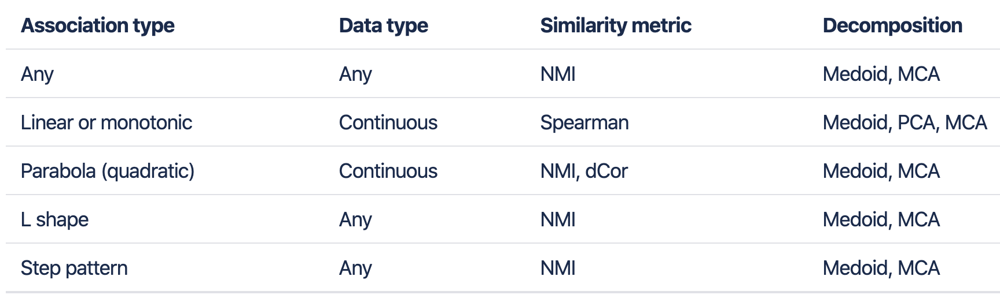

# Halla tutorial

```{r setup, include=FALSE}
knitr::opts_chunk$set(echo = TRUE)
```

## Introduction

HAllA (Hierarchical All-against-All association) 是一个针对多维度、异质型数据集的多重关联分析工具。可用于连续型/分类型数值数据，且在同质型（homogeneous）数据集（所有数值皆相同类型，例如：RNA-seq 基因表現）与异质型（heterogeneous）数据集（不同单位或类型的数值，例如：病患临床指标）皆可高效分析。在目前微生物研究中，HAllA是一個常用于微生物组-代谢、微生物组-临床指标、微生物组-转录组（基因表現、miRNA、GO） 等关联分析的重要工具。


[HAllA source](https://huttenhower.sph.harvard.edu/halla)

## HAllA 步骤

### 登102集群: 执行下述步骤

```bash

conda activate /opt/conda/envs/Halla

halla -h

halla -x table_X -y table_Y -m correlation_methods -o output_file --fdr_alpha adjustP --fdr_method FDR_methods

```


### Available pairwise distance metrics:

* spearman (default for continuous data)

* pearson

* mi (A set of properties of Mutual Information result from definition. default for mixed/categorical data)

* nmi (Normalized Mutual Information)

* xicor (Chatterjee correlation, uses rank differences to assess the degree to which one variable is a measurable function of another，适用于离散、非线性关系数据)

* dcor (measures not necessarily linear dependency of two random variables with possibly different dimensions)



### Running procedures

**step1**

The pairwise similarity matrix between all features in X and Y is computed with a specified similarity measure, such as Spearman correlation and normalized mutual information (NMI). This step then generates the p-value and q-value tables.

Note that for handling heterogeneous data, all continuous features are first discretized into bins using a specified binning method.

**step2**

Hierarchical clustering on the features in each dataset is performed using the converted similarity measure used in step 1. It produces a tree for each dataset.

**step3**

Finding densely-associated blocks(pseudocode):

```python
def find_densely_associated_blocks(x, y):
    x_features = all features in x
    y_features = all features in y
    if is_densely_associated(x_features, y_features):
        report block and terminate
    else:
        # bifurcate one according to Gini impurities of the splits
        x_branches, y_branches = bifurcate_one_of(x, y)
        if both x and y are leaves:
            terminate
        for each x_branch and y_branch in x_branches and y_branches:
            find_densely_associated_blocks(x_branch, y_branch)
initial function call: find_densely_associated_blocks(X_root, Y_root)
```

For example, given two datasets of X (features: X1, X2, X3, X4, X5) and Y (features: Y1, Y2, Y3, Y4) both hierarchically clustered in X tree and Y tree, the algorithm first evaluates the roots of both trees and checks if the block consisting of all features of X and Y are densely-associated (if %significance (%reject) >= (1 - FNR)%).

If the block is not densely-associated, the algorithm would bifurcate one of the trees. It would pick one of:

·[X1 X2][X3 X4 X5] >< [Y1 Y2 Y3 Y4] or 

·[X1 X2 X3 X4 X5] >< [Y1 Y2 Y3][Y4]

based on the Gini impurity of the splits (pick the split that produces a lower weighted Gini impurity),

Once it picks the split with the lower impurity (let's say the first split), it will iteratively evaluate the branches:

·find densely-associated blocks in [X1 X2] vs [Y1 Y2 Y3 Y4], and

·find densely-associated blocks in [X3 X4 X5] vs [Y1 Y2 Y3 Y4]

and keep going until it terminates.

## 结果展示


此部分分析用的wgcna生成的宏基因组和代谢组 modules，因此在运行halla的时候需要加上 —alla 取消数据集内部cluster构建。


此部分分析用的GvHD的宏基因组和代谢组的原始数据（spearman-correlation），热图中显著性的cluster均有数字或白点进行标注（过滤条件fdr < 0.05）；其中的数值显示是按照cluster 中最小的 adjust p-value 给定rank，序号越小，显著性越强。
