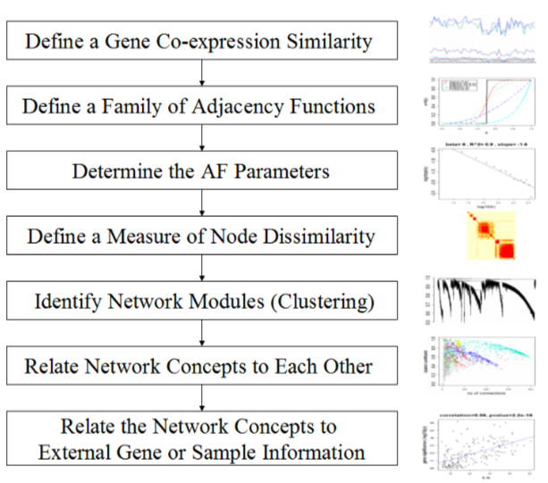
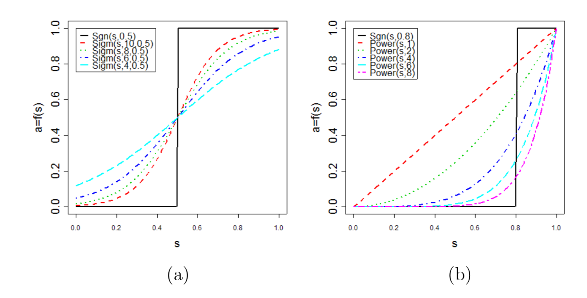
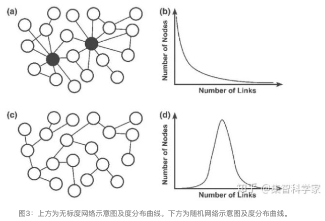
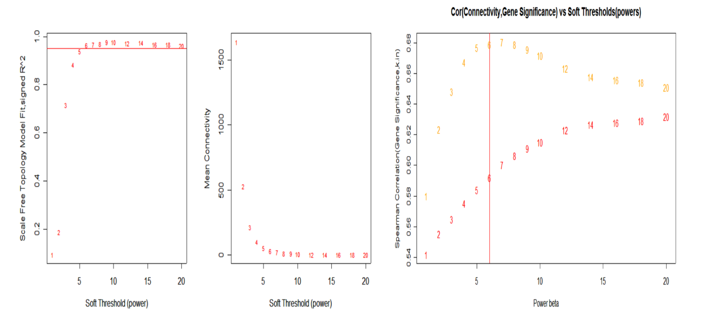
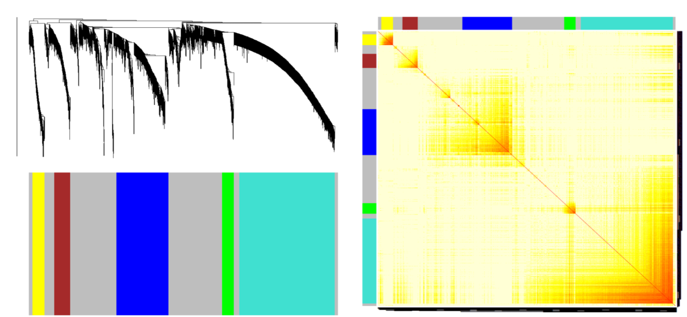
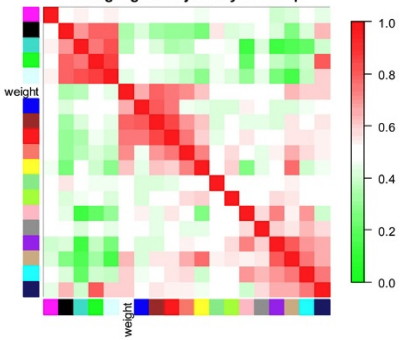
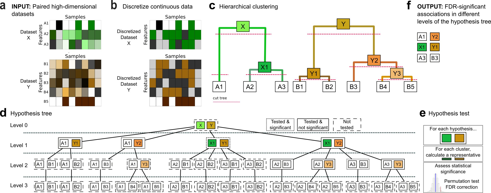
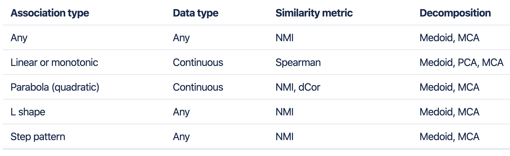

--- 
title: "Omics analysis"
author: "Zhengnong Zhu, Yifan Zhao and Hua Zou"
date: "`r Sys.Date()`"
site: bookdown::bookdown_site
output: bookdown::gitbook
documentclass: book
bibliography: [assets/book.bib, assets/packages.bib]
biblio-style: apalike
link-citations: yes
always_allow_html: true
description: "Tutorial for OMics analysis"
---

# Omics Analysis

多组学整合分析随着高通量技术的广泛应用而生，研究人员可以从基因组、转录组、蛋白质组、交互组、表观基因组、代谢组、脂质体和微生物组等不同分子层面大规模获取组学数据，多组学整合数据分析使得生物学发生了革命性的变化，促进我们对生物过程和分子机制的深刻理解。单一组学分析方法可以提供不同生命进程或者疾病组与正常组相比差异的生物学过程的信息。但是，这些分析往往有局限性。多组学方法整合几个组学水平的信息，为生物机制提供了更多证据，从深层次挖掘候选关键因子；通过将各种组学，不同层面之间信息进行整合，构建基因调控网络，深层次理解各个分子之间的调控及因果关系，从而更深入的认识生物进程和疾病过程中复杂性状的分子机理和遗传基础。

公司常见组学数据类型：微生物组（宏基因组/16S），代谢组，转录组，临床/表型数据等。

## WGCNA Introduction

In this book, we will introduce an method of multi-omics association analysis, entitled WGCNA. We will introduce usage and principle of WGCNA. Moreover, we will utilize GVHD data to illustate pipelines of WGCNA.

Correlation networks are increasingly being used in bioinformatics applications. For example, weighted gene co-expression network analysis is a systems biology method for describing the correlation patterns among genes across microarray samples. Weighted correlation network analysis (WGCNA) can be used for finding clusters (modules) of highly correlated genes, for summarizing such clusters using the module eigengene or an intramodular hub gene, for relating modules to one another and to external sample traits (using eigengene network methodology), and for calculating module membership measures. Correlation networks facilitate network based gene screening methods that can be used to identify candidate biomarkers or therapeutic targets. These methods have been successfully applied in various biological contexts, e.g. cancer, mouse genetics, yeast genetics, and analysis of brain imaging data. While parts of the correlation network methodology have been described in separate publications, there is a need to provide a user-friendly, comprehensive, and consistent software implementation and an accompanying tutorial.

The WGCNA R software package is a comprehensive collection of R functions for performing various aspects of weighted correlation network analysis. The package includes functions for network construction, module detection, gene selection, calculations of topological properties, data simulation, visualization, and interfacing with external software. Along with the R package we also present R software tutorials. While the methods development was motivated by gene expression data, the underlying data mining approach can be applied to a variety of different settings.

[WGCNA source](https://horvath.genetics.ucla.edu/html/CoexpressionNetwork/Rpackages/WGCNA/)

### WGCNA 步骤


#### Step one: The Definition of a Gene Co-expression Similarity

第一步首先确定需要构建网络模块使用那种 correlation 方法去计算节点之间的相关性，常见的方法为 Pearson correlation $s_{ij} = |cor(i,j)|$，那么 similarity matrix $S = [s_{ij}]$。当然，我们可以根据不同的数据使用不同的correlation算法。WGCNA默认的correlation算法为 [bicor](https://en.wikipedia.org/wiki/Biweight_midcorrelation)

#### Step two: The Definition of a Family of Adjacency Functions

第二步是确定邻接矩阵。将similarity matrix 转化为 adjacency matrix，需要一个阈值。确定这个阈值有两种方法，hard threshold 和 soft threshold。

hard threshold 通常使用signum函数作为连接函数来实现：

$$ 
a_{ij} = signum(s_{ij}, \tau) \equiv 
\begin{cases}
1 \quad if s_{ij} \geq \tau \\
0 \quad if s_{ij} \le \tau
\end{cases}
$$
Hard threshoding using the signum function leads to intuitive network concepts, but it may lead to a loss of information: if $\tau$ has been set to 0.8, there will be no connection between two nodes if their similarity equals 0.79.

To avoid the disadvantage of hard thresholding, we propose two types of 'soft' adjacency functions: the sigmoid function

$$
a_{ij} = sigmoid(s_{ij}, \alpha, \tau_{0}) \equiv \frac{1}{1+e^{-\alpha(s_{ij}-\tau_{0})}}
$$
the power adjacency function

$$
a_{ij} = power(s_{ij}, \beta) \equiv |s_{ij}|^\beta
$$


a图为使用sigmoid function的adjacency matrix，b图为使用power function的adjacency matrix。从图中我们可以看出power function的adjacency matrix能够保留大部分强相关连的关系，弱关联的关系则会被消除，能够减少节点之间的连接噪音。在我们的WGCNA流程中我们默认选择的是power function方法去构建adjacency。

#### Step three: Determining the Parameters of the Adjacency Function

第三步是确定adjacency function的参数，对我们的流程来说，就是确定 $\beta$ 参数。为了确定参数，WGCNA提出了无标度拓扑网络（The Scale-free Topology）的概念。无标度网络在pathways, metabolic等生物数据上已经得到了验证，因此我们也假设基因的表达，微生物的生长关系也是符合无标度拓扑网络的概念。因此，当选择的参数需要满足无标度拓扑网络的构建。

什么是无标度网络？



无标度网络的形象描述就是，有一个hub node，大部分的节点与其相连接，而这些节点本身连接较少。

怎么判断合适的 $\beta$?

Earlier, we have described that he linear regression model fitting index $R^2$ can be used to quantify how well a network satisfies a scale-free topology. There is a natural trade-off between maximizing scale-free topology model fit($R^2$) and maintaining a high mean number of connections: parameter values that lead to an $R^2$ value close to 1 may lead to networks with very few connections.



如上图所示，当$\beta$为6时，$R^2$接近与1，但是任然保留较高的connections

#### Step four: Defining a Measure of Node Dissimilarity

第四步确定节点之间的不相似性距离。通过构建node之间的dissimilarity，然后用cluster方法可以将node（gene or others）划分到不同的module，同时也可以观察一个module中的node的连接紧密程度。

The topology overlap matrix (TOM) $\Omega = [w_{ij}]$

$$
w_{ij} = \frac{l_{ij} + a_{ij}}{min\{k_{i}, k_{j}\} + 1 - a_{ij}}
$$
$l_{ij} = \sum_{u}a_{iu}a_{uj}$, 表示i和j共享连接的u之间的关系乘的和

$k_{i} = \sum_{j=1}^na_{ij}$,表示i的所有连接和

dissimilarity measure is defined by $d_{ij}^w = 1 - w_{ij}$

#### Step five: Identifying Gene Modules

第5步划分module。根据$d_{ij}^w$, 用cluster方法划分module



a height cutoff value is chosen in the dendrogram such that some of the resulting branches correspond to dark squares(modules) along the diagonal of the TOM plot.

#### Step six: Relating Network Concepts to Eeach Oter

第六步定义模块中的属性。

1. 比如hub node。Each module can be represented by a centroid, e.g., an intramodular hub gene. Singular value decomposition

$$
X^{(q)} = [x_{ij}^{(q)}] = (x_{1}^{(q)} \quad x_{2}^{(q)} \quad x_{3}^{(q)} \dots x_{n}^{(q)})^T \\
X^{(q)} = U^{(q)}D^{(q)}(V^{(q)})^T \\
V^{(q)} = (v_{1}^{(q)} \quad v_{2}^{(q)} \quad v_{3}^{(q)} \dots v_{m}^{(q)})
$$
Module Eigengene:
$$
E^{(q)} = v_{1}^{(q)}
$$
2. module之间的correlation，如果两个module的correlation很高，可以合并两个module为一个。

#### Step seven: Relating Network Concepts to External Gene or Sample Information

第七步，将module与外部数据相关联，找到感兴趣的module。

A main purpose of many network analysis is to relate a connectivity measure to external gene information. For example, In our cancer microarray application, we show that for brown module genes intramodular connectivity is highly correlated with prognostic significance for cancer surival.



如上图所示，临床数据（weight）与brown module最相关，表示这个module中的gene or node对weight有显著性的影响。

## HAllA Introduction

HAllA (Hierarchical All-against-All association) 是一个针对多维度、异质型数据集的多重关联分析工具。可用于连续型/分类型数值数据，且在同质型（homogeneous）数据集（所有数值皆相同类型，例如：RNA-seq 基因表現）与异质型（heterogeneous）数据集（不同单位或类型的数值，例如：病患临床指标）皆可高效分析。在目前微生物研究中，HAllA是一個常用于微生物组-代谢、微生物组-临床指标、微生物组-转录组（基因表現、miRNA、GO） 等关联分析的重要工具。

[HAllA source](https://huttenhower.sph.harvard.edu/halla)





### Available pairwise distance metrics:

* spearman (default for continuous data)

* pearson

* mi (A set of properties of Mutual Information result from definition. default for mixed/categorical data)

* nmi (Normalized Mutual Information)

* xicor (Chatterjee correlation, uses rank differences to assess the degree to which one variable is a measurable function of another，适用于离散、非线性关系数据)

* dcor (measures not necessarily linear dependency of two random variables with possibly different dimensions)



### Running procedures

**step1**

The pairwise similarity matrix between all features in X and Y is computed with a specified similarity measure, such as Spearman correlation and normalized mutual information (NMI). This step then generates the p-value and q-value tables.

Note that for handling heterogeneous data, all continuous features are first discretized into bins using a specified binning method.

**step2**

Hierarchical clustering on the features in each dataset is performed using the converted similarity measure used in step 1. It produces a tree for each dataset.

**step3**

Finding densely-associated blocks(pseudocode):

```python
def find_densely_associated_blocks(x, y):
    x_features = all features in x
    y_features = all features in y
    if is_densely_associated(x_features, y_features):
        report block and terminate
    else:
        # bifurcate one according to Gini impurities of the splits
        x_branches, y_branches = bifurcate_one_of(x, y)
        if both x and y are leaves:
            terminate
        for each x_branch and y_branch in x_branches and y_branches:
            find_densely_associated_blocks(x_branch, y_branch)
initial function call: find_densely_associated_blocks(X_root, Y_root)
```

For example, given two datasets of X (features: X1, X2, X3, X4, X5) and Y (features: Y1, Y2, Y3, Y4) both hierarchically clustered in X tree and Y tree, the algorithm first evaluates the roots of both trees and checks if the block consisting of all features of X and Y are densely-associated (if %significance (%reject) >= (1 - FNR)%).

If the block is not densely-associated, the algorithm would bifurcate one of the trees. It would pick one of:

·[X1 X2][X3 X4 X5] >< [Y1 Y2 Y3 Y4] or 

·[X1 X2 X3 X4 X5] >< [Y1 Y2 Y3][Y4]

based on the Gini impurity of the splits (pick the split that produces a lower weighted Gini impurity),

Once it picks the split with the lower impurity (let's say the first split), it will iteratively evaluate the branches:

·find densely-associated blocks in [X1 X2] vs [Y1 Y2 Y3 Y4], and

·find densely-associated blocks in [X3 X4 X5] vs [Y1 Y2 Y3 Y4]

and keep going until it terminates.


## Network Analysis

> Estimating microbial association networks from high-throughput sequencing data is a common exploratory data analysis approach aiming at understanding the complex interplay of microbial communities in their natural habitat. Statistical network estimation workflows comprise several analysis steps, including methods for zero handling, data normalization and computing microbial associations. Since microbial interactions are likely to change between conditions, e.g. between healthy individuals and patients, identifying network differences between groups is often an integral secondary analysis step.
